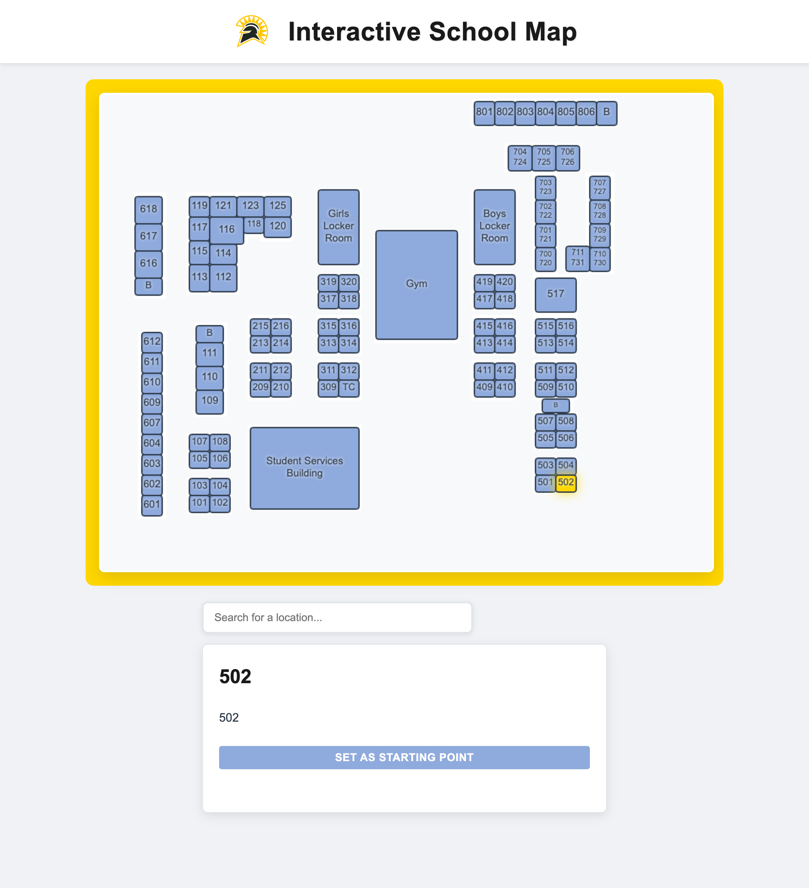

# Interactive High School Map

An interactive, web-based campus navigation system that allows students and staff to explore school buildings and find optimal pathways between locations. Built with vanilla JavaScript and HTML5 Canvas for smooth, responsive interactions.



## Features

- **Interactive Campus Map** - Visual representation of all school buildings, classrooms, and facilities
- **Smart Search** - Real-time search functionality to quickly find any room or location
- **Pathfinding** - Intelligent routing system that calculates and highlights the shortest path between two locations
- **Building Information** - Click on any building to view detailed information including room numbers and teachers
- **Visual Feedback** - Color-coded buildings with hover effects and state indicators:
  - 🟦 Blue: Default buildings
  - 🟩 Green: Starting point
  - 🟥 Red: Destination
  - 🟧 Orange: Search results
  - 🟨 Gold: Selected building or active path
- **Responsive Design** - Clean, modern interface that works across different screen sizes

## Technologies Used

- **HTML5** - Semantic markup and Canvas element for rendering
- **CSS3** - Modern styling with flexbox layout
- **JavaScript (ES6+)** - Modular architecture using ES6 modules
  - `main.js` - Core application logic and rendering
  - `pathfinding.js` - A* pathfinding algorithm implementation
  - `geometry.js` - Geometric calculations and collision detection
- **Canvas API** - Hardware-accelerated 2D graphics rendering
- **JSON** - Building and location data storage

## How to Run

### Option 1: Simple HTTP Server (Recommended)

1. Clone the repository:
   ```bash
   git clone https://github.com/RoeeFrenkel/InteractiveMap_v1.git
   cd InteractiveMap_v1
   ```

2. Start a local web server:

   **Using Python 3:**
   ```bash
   python3 -m http.server 8000
   ```

   **Using Python 2:**
   ```bash
   python -m SimpleHTTPServer 8000
   ```

   **Using Node.js (with npx):**
   ```bash
   npx http-server -p 8000
   ```

3. Open your browser and navigate to:
   ```
   http://localhost:8000
   ```

### Option 2: Direct File Access

While not recommended due to ES6 module restrictions in some browsers, you can try opening `index.html` directly in your browser. If you encounter CORS errors, use Option 1 instead.

## Usage

1. **Search for a Location**: Type in the search box to find any room, building, or facility
2. **Select Buildings**: Click on any building on the map to view its details
3. **Find a Path**:
   - Click "Set as Starting Point" on your current location
   - Search for and click on your destination
   - The shortest path will be highlighted in gold
4. **Explore**: Hover over buildings to see interactive hover effects

## Project Structure

```
InteractiveHighSchoolMap/
├── index.html          # Main HTML file
├── styles.css          # Styling and layout
├── main.js            # Core application logic and rendering engine
├── pathfinding.js     # A* pathfinding algorithm implementation
├── geometry.js        # Geometric utility functions
├── buildings.json     # Building and room data
├── spartans_image.png # School logo
└── screenshot.png     # Application screenshot
```

## Building Data Format

The `buildings.json` file contains an array of building objects with the following structure:

```json
{
  "id": 618,
  "name": "618",
  "info": "Mr West",
  "x": 50,
  "y": 190,
  "width": 40,
  "height": 40
}
```

## Future Enhancements

- Mobile-responsive touch controls
- Accessibility features (keyboard navigation, screen reader support)
- Multiple floor support
- Real-time occupancy indicators
- Save favorite locations
- Share routes via URL

## License

This project is open source and available under the [MIT License](LICENSE).

## Contributing

Contributions are welcome! Please feel free to submit a Pull Request.

---
